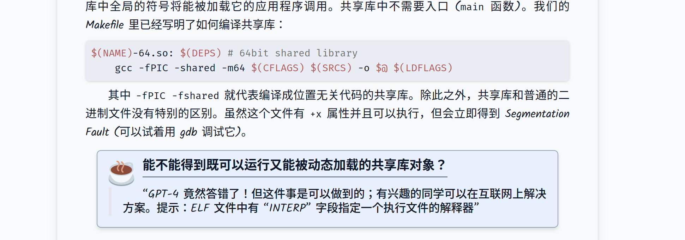
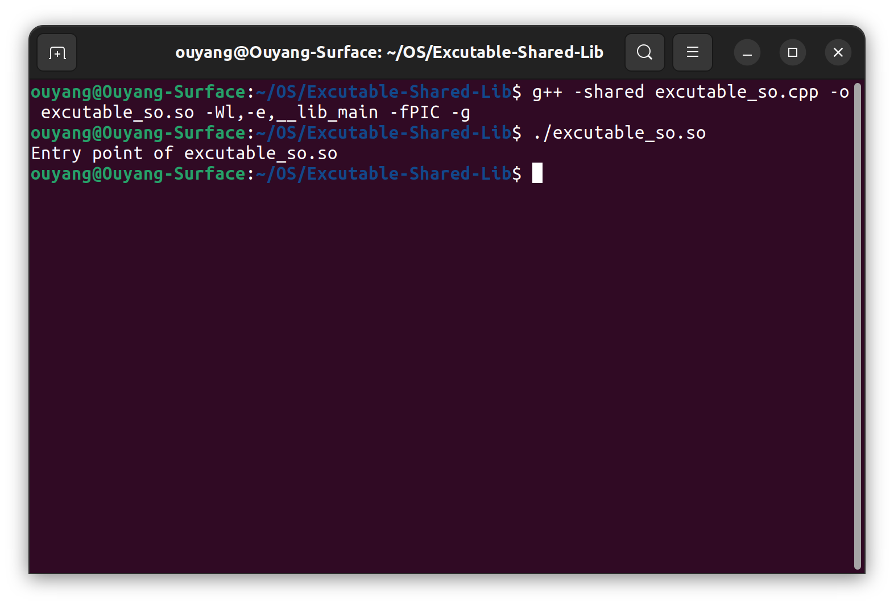

# Excutable-Shared-Lib
***

对于
https://jyywiki.cn/OS/2024/labs/M2.md
中的问题：能不能得到既可以运行又能被动态加载的共享库对象

参考

https://www.cnblogs.com/motadou/p/9644566.html 
https://spockwangs.github.io/blog/2012/02/02/genenerate-executable-library/

进行的一次尝试
***
编译时设置入口函数-Wl,-e,__lib_main

由于不明原因，进入函数时rsp未对齐16字节。由于x86-64 要求堆栈按照 16 字节对齐 (x86-64 的堆栈以 8 字节为一个单元)——这是为了确保 SSE 指令集中 XMM 寄存器变量的对齐，在执行到printf里对于xmm寄存器的movaps时会遇到神秘的 Segmentation Fault
参考：https://jyywiki.cn/OS/2022/labs/M2.html 

在函数入口处内联汇编 __asm__ __volatile__("andq $-16, %rsp"); 使rsp强制对齐16字节
***
测试结果
